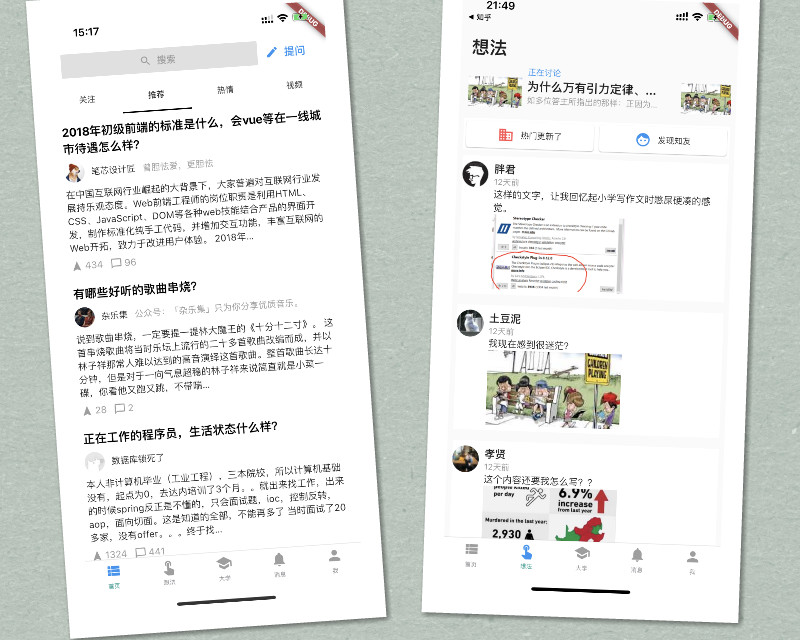
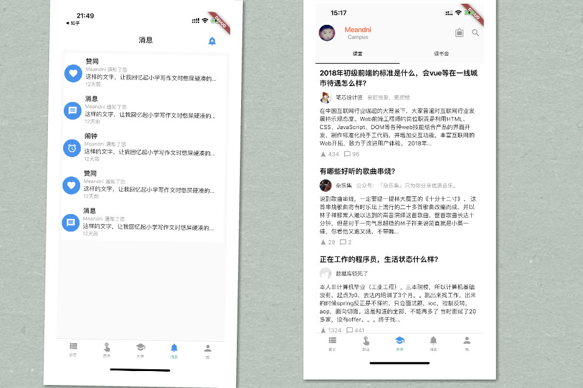
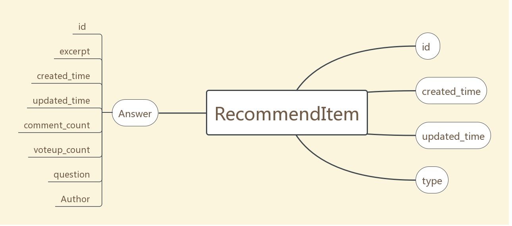
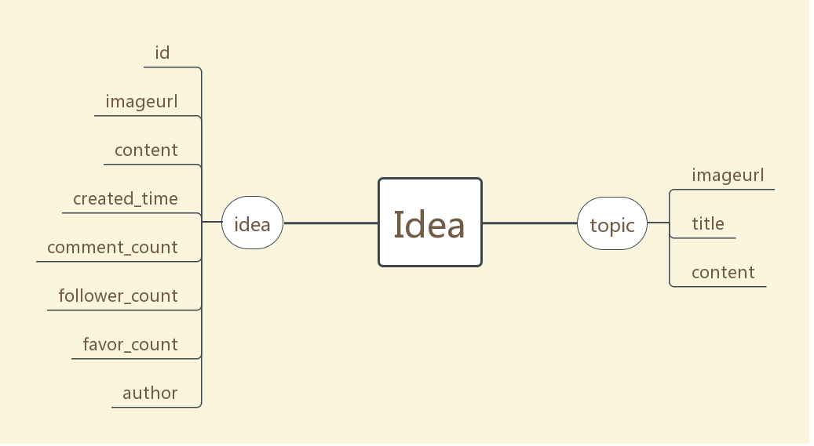
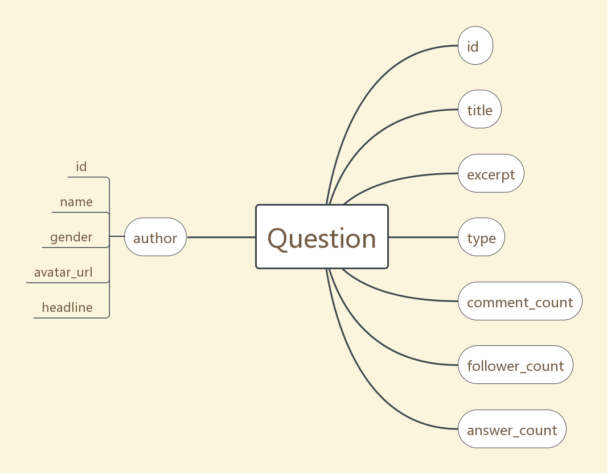

## Flutter实践之知乎App

预览图：






#### 开发环境

```
Flutter 1.0.0 • channel stable • https://github.com/flutter/flutter.git
Framework • revision 5391447fae (9 weeks ago) • 2018-11-29 19:41:26 -0800
Engine • revision 7375a0f414
Tools • Dart 2.1.0 (build 2.1.0-dev.9.4 f9ebf21297)
```

#### 编译运行

1. 克隆代码

   ```
   git clone https://github.com/MeandNi/Flutter_ZhiHu.git
   ```

2. 安装依赖

   ```
   flutter packages get
   ```

#### UI 大致结构


采用类似 Android 模块化思想，将整个 App 的内容分为5个部分.


#### Ui 细节

暂不叙述，期待后续文章总结。项目目前还在更新完善中，预计使用Redux、Sqlflite等技术栈填充数据部分，本项目部分界面及工具类来自[Flutter_CommonApp](https://link.juejin.im/?target=https%3A%2F%2Fgithub.com%2FMeandNi%2FFlutter_CommonApp) 。

 #### 数据结构







#### 第三方框架

| 库                         | 功能         |
| -------------------------- | ------------ |
| **dio**                    | **网络框架** |
| **carousel_slider**        | **轮播图**   |
| **cached_network_image**   | **图片加载** |
| **share**                  | **链接分享** |
| **flutter_webview_plugin** | **WebView**  |


#### 鸣谢

感谢那些热爱开源、一起奋斗的朋友们。

值得学习的话，Star哦^_^